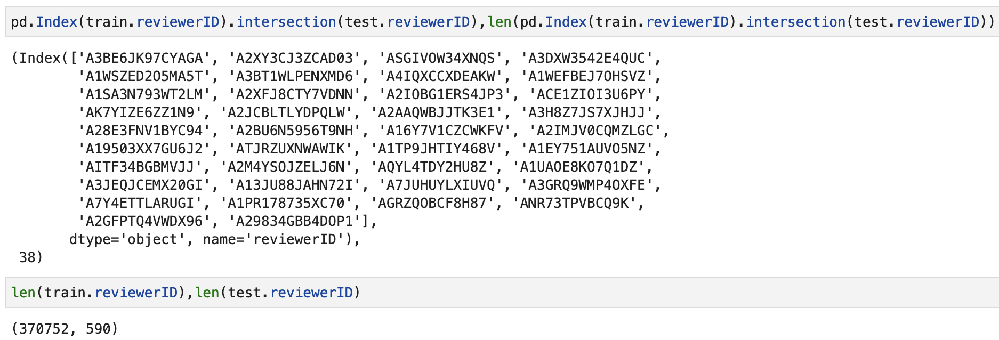
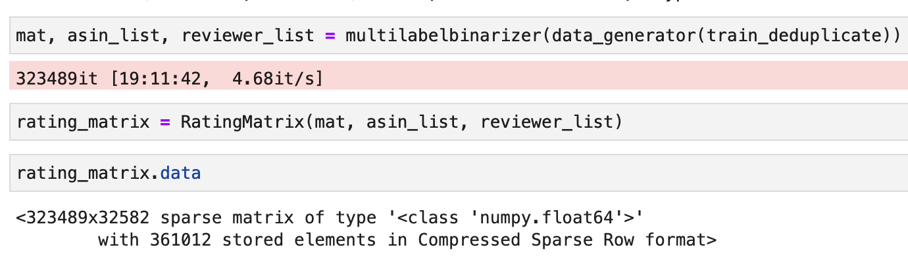
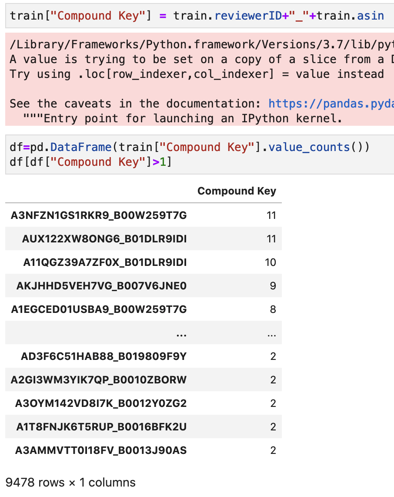

# Requeured
    清楚記載這個專案的目的和結果，最後的推薦分數是多少，是否有成功
    簡明清楚的使用說明：用了哪些工具和方法？為什麼？


# 專案目的
Ruled Base推薦系統

# 工具
python, pandas

# 步驟
1. EDA 

- train test的bias


發現交集只有38個user 相對testing 590跟歷史總共37萬個來說太少
雖然evaluate是by user, 但就統一當成召回問題, 設定業務邏輯為一路召回路徑

- 全站疏密度

所有資料建成的matrix過度稀疏, 而且建立起來沒優化情況下挺耗時的

- 重複購買？

有重複購買某項商品的紀錄 總共九千多筆而已
雖然可能可以當作核心用戶處理, 但跟train跟test交集太少 先pass 

- 時間
可以看到最早紀錄到現在時間跨度太多(2000-01-10~2018-09)但資料過於稀疏
美妝又是有季節性週期性的, 因此時間是重要因此, 全站數據沒意義

- also view, also buy
從前面結論的稀疏性可以大約猜想 這應該沒有太大意義

# 規則設定
1.所有user都當冷啟動

2. top_K取 1 3 5 10 15 20
```
1, 3是假設是pop up
3,5是假設推薦版位,
10, 15, 20是feeds流或是召回階段設定數量
```
3. 以週為單位切分
```
經驗上以上一季或是每年的同一季節就足夠
實際上要看品項
這邊先以最多到上一季來做回測
```

4. 最小評分要求至少大於多少


最終依照上述規則排列組合, 抓超參數

# 結果
top 5左右 是0.115
top 20 可以到 0.23 0.24左右

# 是否有成功？
這好像沒有成功與否的問題
資料量少, 回頭率低, 又沒有瀏覽紀錄的話
這種完全冷啟動的情況就只是一種邏輯而已
這種作法可能比較會在意的是CTR吧

# 結果資料
```
date_range:2018-08-25~2018-09-01, rating_minimun_thresold:0,top_k:1 socre:0.084
date_range:2018-08-25~2018-09-01, rating_minimun_thresold:0,top_k:3 socre:0.098
date_range:2018-08-25~2018-09-01, rating_minimun_thresold:0,top_k:5 socre:0.134
date_range:2018-08-25~2018-09-01, rating_minimun_thresold:0,top_k:10 socre:0.158
date_range:2018-08-25~2018-09-01, rating_minimun_thresold:0,top_k:15 socre:0.17
date_range:2018-08-25~2018-09-01, rating_minimun_thresold:0,top_k:20 socre:0.182
date_range:2018-08-25~2018-09-01, rating_minimun_thresold:1,top_k:1 socre:0.084
date_range:2018-08-25~2018-09-01, rating_minimun_thresold:1,top_k:3 socre:0.098
date_range:2018-08-25~2018-09-01, rating_minimun_thresold:1,top_k:5 socre:0.115
date_range:2018-08-25~2018-09-01, rating_minimun_thresold:1,top_k:10 socre:0.156
date_range:2018-08-25~2018-09-01, rating_minimun_thresold:1,top_k:15 socre:0.17
date_range:2018-08-25~2018-09-01, rating_minimun_thresold:1,top_k:20 socre:0.183
date_range:2018-08-25~2018-09-01, rating_minimun_thresold:2,top_k:1 socre:0.084
date_range:2018-08-25~2018-09-01, rating_minimun_thresold:2,top_k:3 socre:0.098
date_range:2018-08-25~2018-09-01, rating_minimun_thresold:2,top_k:5 socre:0.113
date_range:2018-08-25~2018-09-01, rating_minimun_thresold:2,top_k:10 socre:0.159
date_range:2018-08-25~2018-09-01, rating_minimun_thresold:2,top_k:15 socre:0.171
date_range:2018-08-25~2018-09-01, rating_minimun_thresold:2,top_k:20 socre:0.185
date_range:2018-08-25~2018-09-01, rating_minimun_thresold:3,top_k:1 socre:0.084
date_range:2018-08-25~2018-09-01, rating_minimun_thresold:3,top_k:3 socre:0.098
date_range:2018-08-25~2018-09-01, rating_minimun_thresold:3,top_k:5 socre:0.111
date_range:2018-08-25~2018-09-01, rating_minimun_thresold:3,top_k:10 socre:0.159
date_range:2018-08-25~2018-09-01, rating_minimun_thresold:3,top_k:15 socre:0.171
date_range:2018-08-25~2018-09-01, rating_minimun_thresold:3,top_k:20 socre:0.182
date_range:2018-08-25~2018-09-01, rating_minimun_thresold:4,top_k:1 socre:0.084
date_range:2018-08-25~2018-09-01, rating_minimun_thresold:4,top_k:3 socre:0.101
date_range:2018-08-25~2018-09-01, rating_minimun_thresold:4,top_k:5 socre:0.137
date_range:2018-08-25~2018-09-01, rating_minimun_thresold:4,top_k:10 socre:0.147
date_range:2018-08-25~2018-09-01, rating_minimun_thresold:4,top_k:15 socre:0.17
date_range:2018-08-25~2018-09-01, rating_minimun_thresold:4,top_k:20 socre:0.17
date_range:2018-08-18~2018-09-01, rating_minimun_thresold:0,top_k:1 socre:0.003
date_range:2018-08-18~2018-09-01, rating_minimun_thresold:0,top_k:3 socre:0.101
date_range:2018-08-18~2018-09-01, rating_minimun_thresold:0,top_k:5 socre:0.113
date_range:2018-08-18~2018-09-01, rating_minimun_thresold:0,top_k:10 socre:0.142
date_range:2018-08-18~2018-09-01, rating_minimun_thresold:0,top_k:15 socre:0.173
date_range:2018-08-18~2018-09-01, rating_minimun_thresold:0,top_k:20 socre:0.243
date_range:2018-08-18~2018-09-01, rating_minimun_thresold:1,top_k:1 socre:0.003
date_range:2018-08-18~2018-09-01, rating_minimun_thresold:1,top_k:3 socre:0.101
date_range:2018-08-18~2018-09-01, rating_minimun_thresold:1,top_k:5 socre:0.113
date_range:2018-08-18~2018-09-01, rating_minimun_thresold:1,top_k:10 socre:0.142
date_range:2018-08-18~2018-09-01, rating_minimun_thresold:1,top_k:15 socre:0.168
date_range:2018-08-18~2018-09-01, rating_minimun_thresold:1,top_k:20 socre:0.235
date_range:2018-08-18~2018-09-01, rating_minimun_thresold:2,top_k:1 socre:0.003
date_range:2018-08-18~2018-09-01, rating_minimun_thresold:2,top_k:3 socre:0.101
date_range:2018-08-18~2018-09-01, rating_minimun_thresold:2,top_k:5 socre:0.123
date_range:2018-08-18~2018-09-01, rating_minimun_thresold:2,top_k:10 socre:0.156
date_range:2018-08-18~2018-09-01, rating_minimun_thresold:2,top_k:15 socre:0.193
date_range:2018-08-18~2018-09-01, rating_minimun_thresold:2,top_k:20 socre:0.235
date_range:2018-08-18~2018-09-01, rating_minimun_thresold:3,top_k:1 socre:0.003
date_range:2018-08-18~2018-09-01, rating_minimun_thresold:3,top_k:3 socre:0.101
date_range:2018-08-18~2018-09-01, rating_minimun_thresold:3,top_k:5 socre:0.123
date_range:2018-08-18~2018-09-01, rating_minimun_thresold:3,top_k:10 socre:0.158
date_range:2018-08-18~2018-09-01, rating_minimun_thresold:3,top_k:15 socre:0.202
date_range:2018-08-18~2018-09-01, rating_minimun_thresold:3,top_k:20 socre:0.233
date_range:2018-08-18~2018-09-01, rating_minimun_thresold:4,top_k:1 socre:0.003
date_range:2018-08-18~2018-09-01, rating_minimun_thresold:4,top_k:3 socre:0.087
date_range:2018-08-18~2018-09-01, rating_minimun_thresold:4,top_k:5 socre:0.103
date_range:2018-08-18~2018-09-01, rating_minimun_thresold:4,top_k:10 socre:0.154
date_range:2018-08-18~2018-09-01, rating_minimun_thresold:4,top_k:15 socre:0.216
date_range:2018-08-18~2018-09-01, rating_minimun_thresold:4,top_k:20 socre:0.231
date_range:2018-08-11~2018-09-01, rating_minimun_thresold:0,top_k:1 socre:0.084
date_range:2018-08-11~2018-09-01, rating_minimun_thresold:0,top_k:3 socre:0.087
date_range:2018-08-11~2018-09-01, rating_minimun_thresold:0,top_k:5 socre:0.103
date_range:2018-08-11~2018-09-01, rating_minimun_thresold:0,top_k:10 socre:0.144
date_range:2018-08-11~2018-09-01, rating_minimun_thresold:0,top_k:15 socre:0.195
date_range:2018-08-11~2018-09-01, rating_minimun_thresold:0,top_k:20 socre:0.226
date_range:2018-08-11~2018-09-01, rating_minimun_thresold:1,top_k:1 socre:0.084
date_range:2018-08-11~2018-09-01, rating_minimun_thresold:1,top_k:3 socre:0.087
date_range:2018-08-11~2018-09-01, rating_minimun_thresold:1,top_k:5 socre:0.103
date_range:2018-08-11~2018-09-01, rating_minimun_thresold:1,top_k:10 socre:0.144
date_range:2018-08-11~2018-09-01, rating_minimun_thresold:1,top_k:15 socre:0.199
date_range:2018-08-11~2018-09-01, rating_minimun_thresold:1,top_k:20 socre:0.226
date_range:2018-08-11~2018-09-01, rating_minimun_thresold:2,top_k:1 socre:0.084
date_range:2018-08-11~2018-09-01, rating_minimun_thresold:2,top_k:3 socre:0.087
date_range:2018-08-11~2018-09-01, rating_minimun_thresold:2,top_k:5 socre:0.103
date_range:2018-08-11~2018-09-01, rating_minimun_thresold:2,top_k:10 socre:0.161
date_range:2018-08-11~2018-09-01, rating_minimun_thresold:2,top_k:15 socre:0.195
date_range:2018-08-11~2018-09-01, rating_minimun_thresold:2,top_k:20 socre:0.219
date_range:2018-08-11~2018-09-01, rating_minimun_thresold:3,top_k:1 socre:0.084
date_range:2018-08-11~2018-09-01, rating_minimun_thresold:3,top_k:3 socre:0.087
date_range:2018-08-11~2018-09-01, rating_minimun_thresold:3,top_k:5 socre:0.103
date_range:2018-08-11~2018-09-01, rating_minimun_thresold:3,top_k:10 socre:0.144
date_range:2018-08-11~2018-09-01, rating_minimun_thresold:3,top_k:15 socre:0.182
date_range:2018-08-11~2018-09-01, rating_minimun_thresold:3,top_k:20 socre:0.223
date_range:2018-08-11~2018-09-01, rating_minimun_thresold:4,top_k:1 socre:0.003
date_range:2018-08-11~2018-09-01, rating_minimun_thresold:4,top_k:3 socre:0.087
date_range:2018-08-11~2018-09-01, rating_minimun_thresold:4,top_k:5 socre:0.103
date_range:2018-08-11~2018-09-01, rating_minimun_thresold:4,top_k:10 socre:0.168
date_range:2018-08-11~2018-09-01, rating_minimun_thresold:4,top_k:15 socre:0.19
date_range:2018-08-11~2018-09-01, rating_minimun_thresold:4,top_k:20 socre:0.245
date_range:2018-08-04~2018-09-01, rating_minimun_thresold:0,top_k:1 socre:0.084
date_range:2018-08-04~2018-09-01, rating_minimun_thresold:0,top_k:3 socre:0.086
date_range:2018-08-04~2018-09-01, rating_minimun_thresold:0,top_k:5 socre:0.089
date_range:2018-08-04~2018-09-01, rating_minimun_thresold:0,top_k:10 socre:0.159
date_range:2018-08-04~2018-09-01, rating_minimun_thresold:0,top_k:15 socre:0.173
date_range:2018-08-04~2018-09-01, rating_minimun_thresold:0,top_k:20 socre:0.197
date_range:2018-08-04~2018-09-01, rating_minimun_thresold:1,top_k:1 socre:0.084
date_range:2018-08-04~2018-09-01, rating_minimun_thresold:1,top_k:3 socre:0.087
date_range:2018-08-04~2018-09-01, rating_minimun_thresold:1,top_k:5 socre:0.103
date_range:2018-08-04~2018-09-01, rating_minimun_thresold:1,top_k:10 socre:0.144
date_range:2018-08-04~2018-09-01, rating_minimun_thresold:1,top_k:15 socre:0.175
date_range:2018-08-04~2018-09-01, rating_minimun_thresold:1,top_k:20 socre:0.212
date_range:2018-08-04~2018-09-01, rating_minimun_thresold:2,top_k:1 socre:0.084
date_range:2018-08-04~2018-09-01, rating_minimun_thresold:2,top_k:3 socre:0.087
date_range:2018-08-04~2018-09-01, rating_minimun_thresold:2,top_k:5 socre:0.103
date_range:2018-08-04~2018-09-01, rating_minimun_thresold:2,top_k:10 socre:0.144
date_range:2018-08-04~2018-09-01, rating_minimun_thresold:2,top_k:15 socre:0.173
date_range:2018-08-04~2018-09-01, rating_minimun_thresold:2,top_k:20 socre:0.224
date_range:2018-08-04~2018-09-01, rating_minimun_thresold:3,top_k:1 socre:0.084
date_range:2018-08-04~2018-09-01, rating_minimun_thresold:3,top_k:3 socre:0.087
date_range:2018-08-04~2018-09-01, rating_minimun_thresold:3,top_k:5 socre:0.103
date_range:2018-08-04~2018-09-01, rating_minimun_thresold:3,top_k:10 socre:0.144
date_range:2018-08-04~2018-09-01, rating_minimun_thresold:3,top_k:15 socre:0.159
date_range:2018-08-04~2018-09-01, rating_minimun_thresold:3,top_k:20 socre:0.202
date_range:2018-08-04~2018-09-01, rating_minimun_thresold:4,top_k:1 socre:0.084
date_range:2018-08-04~2018-09-01, rating_minimun_thresold:4,top_k:3 socre:0.087
date_range:2018-08-04~2018-09-01, rating_minimun_thresold:4,top_k:5 socre:0.103
date_range:2018-08-04~2018-09-01, rating_minimun_thresold:4,top_k:10 socre:0.142
date_range:2018-08-04~2018-09-01, rating_minimun_thresold:4,top_k:15 socre:0.159
date_range:2018-08-04~2018-09-01, rating_minimun_thresold:4,top_k:20 socre:0.204
date_range:2018-07-28~2018-09-01, rating_minimun_thresold:0,top_k:1 socre:0.084
date_range:2018-07-28~2018-09-01, rating_minimun_thresold:0,top_k:3 socre:0.086
date_range:2018-07-28~2018-09-01, rating_minimun_thresold:0,top_k:5 socre:0.098
date_range:2018-07-28~2018-09-01, rating_minimun_thresold:0,top_k:10 socre:0.139
date_range:2018-07-28~2018-09-01, rating_minimun_thresold:0,top_k:15 socre:0.183
date_range:2018-07-28~2018-09-01, rating_minimun_thresold:0,top_k:20 socre:0.219
date_range:2018-07-28~2018-09-01, rating_minimun_thresold:1,top_k:1 socre:0.084
date_range:2018-07-28~2018-09-01, rating_minimun_thresold:1,top_k:3 socre:0.086
date_range:2018-07-28~2018-09-01, rating_minimun_thresold:1,top_k:5 socre:0.101
date_range:2018-07-28~2018-09-01, rating_minimun_thresold:1,top_k:10 socre:0.139
date_range:2018-07-28~2018-09-01, rating_minimun_thresold:1,top_k:15 socre:0.192
date_range:2018-07-28~2018-09-01, rating_minimun_thresold:1,top_k:20 socre:0.214
date_range:2018-07-28~2018-09-01, rating_minimun_thresold:2,top_k:1 socre:0.084
date_range:2018-07-28~2018-09-01, rating_minimun_thresold:2,top_k:3 socre:0.086
date_range:2018-07-28~2018-09-01, rating_minimun_thresold:2,top_k:5 socre:0.103
date_range:2018-07-28~2018-09-01, rating_minimun_thresold:2,top_k:10 socre:0.139
date_range:2018-07-28~2018-09-01, rating_minimun_thresold:2,top_k:15 socre:0.185
date_range:2018-07-28~2018-09-01, rating_minimun_thresold:2,top_k:20 socre:0.217
date_range:2018-07-28~2018-09-01, rating_minimun_thresold:3,top_k:1 socre:0.084
date_range:2018-07-28~2018-09-01, rating_minimun_thresold:3,top_k:3 socre:0.086
date_range:2018-07-28~2018-09-01, rating_minimun_thresold:3,top_k:5 socre:0.103
date_range:2018-07-28~2018-09-01, rating_minimun_thresold:3,top_k:10 socre:0.144
date_range:2018-07-28~2018-09-01, rating_minimun_thresold:3,top_k:15 socre:0.185
date_range:2018-07-28~2018-09-01, rating_minimun_thresold:3,top_k:20 socre:0.202
date_range:2018-07-28~2018-09-01, rating_minimun_thresold:4,top_k:1 socre:0.084
date_range:2018-07-28~2018-09-01, rating_minimun_thresold:4,top_k:3 socre:0.087
date_range:2018-07-28~2018-09-01, rating_minimun_thresold:4,top_k:5 socre:0.103
date_range:2018-07-28~2018-09-01, rating_minimun_thresold:4,top_k:10 socre:0.168
date_range:2018-07-28~2018-09-01, rating_minimun_thresold:4,top_k:15 socre:0.187
date_range:2018-07-28~2018-09-01, rating_minimun_thresold:4,top_k:20 socre:0.216
date_range:2018-07-21~2018-09-01, rating_minimun_thresold:0,top_k:1 socre:0.084
date_range:2018-07-21~2018-09-01, rating_minimun_thresold:0,top_k:3 socre:0.086
date_range:2018-07-21~2018-09-01, rating_minimun_thresold:0,top_k:5 socre:0.098
date_range:2018-07-21~2018-09-01, rating_minimun_thresold:0,top_k:10 socre:0.154
date_range:2018-07-21~2018-09-01, rating_minimun_thresold:0,top_k:15 socre:0.168
date_range:2018-07-21~2018-09-01, rating_minimun_thresold:0,top_k:20 socre:0.195
date_range:2018-07-21~2018-09-01, rating_minimun_thresold:1,top_k:1 socre:0.084
date_range:2018-07-21~2018-09-01, rating_minimun_thresold:1,top_k:3 socre:0.086
date_range:2018-07-21~2018-09-01, rating_minimun_thresold:1,top_k:5 socre:0.098
date_range:2018-07-21~2018-09-01, rating_minimun_thresold:1,top_k:10 socre:0.156
date_range:2018-07-21~2018-09-01, rating_minimun_thresold:1,top_k:15 socre:0.168
date_range:2018-07-21~2018-09-01, rating_minimun_thresold:1,top_k:20 socre:0.214
date_range:2018-07-21~2018-09-01, rating_minimun_thresold:2,top_k:1 socre:0.084
date_range:2018-07-21~2018-09-01, rating_minimun_thresold:2,top_k:3 socre:0.086
date_range:2018-07-21~2018-09-01, rating_minimun_thresold:2,top_k:5 socre:0.103
date_range:2018-07-21~2018-09-01, rating_minimun_thresold:2,top_k:10 socre:0.139
date_range:2018-07-21~2018-09-01, rating_minimun_thresold:2,top_k:15 socre:0.166
date_range:2018-07-21~2018-09-01, rating_minimun_thresold:2,top_k:20 socre:0.214
date_range:2018-07-21~2018-09-01, rating_minimun_thresold:3,top_k:1 socre:0.084
date_range:2018-07-21~2018-09-01, rating_minimun_thresold:3,top_k:3 socre:0.086
date_range:2018-07-21~2018-09-01, rating_minimun_thresold:3,top_k:5 socre:0.103
date_range:2018-07-21~2018-09-01, rating_minimun_thresold:3,top_k:10 socre:0.144
date_range:2018-07-21~2018-09-01, rating_minimun_thresold:3,top_k:15 socre:0.166
date_range:2018-07-21~2018-09-01, rating_minimun_thresold:3,top_k:20 socre:0.214
date_range:2018-07-21~2018-09-01, rating_minimun_thresold:4,top_k:1 socre:0.084
date_range:2018-07-21~2018-09-01, rating_minimun_thresold:4,top_k:3 socre:0.086
date_range:2018-07-21~2018-09-01, rating_minimun_thresold:4,top_k:5 socre:0.101
date_range:2018-07-21~2018-09-01, rating_minimun_thresold:4,top_k:10 socre:0.144
date_range:2018-07-21~2018-09-01, rating_minimun_thresold:4,top_k:15 socre:0.173
date_range:2018-07-21~2018-09-01, rating_minimun_thresold:4,top_k:20 socre:0.209
date_range:2018-07-14~2018-09-01, rating_minimun_thresold:0,top_k:1 socre:0.084
date_range:2018-07-14~2018-09-01, rating_minimun_thresold:0,top_k:3 socre:0.086
date_range:2018-07-14~2018-09-01, rating_minimun_thresold:0,top_k:5 socre:0.098
date_range:2018-07-14~2018-09-01, rating_minimun_thresold:0,top_k:10 socre:0.154
date_range:2018-07-14~2018-09-01, rating_minimun_thresold:0,top_k:15 socre:0.175
date_range:2018-07-14~2018-09-01, rating_minimun_thresold:0,top_k:20 socre:0.188
date_range:2018-07-14~2018-09-01, rating_minimun_thresold:1,top_k:1 socre:0.084
date_range:2018-07-14~2018-09-01, rating_minimun_thresold:1,top_k:3 socre:0.086
date_range:2018-07-14~2018-09-01, rating_minimun_thresold:1,top_k:5 socre:0.111
date_range:2018-07-14~2018-09-01, rating_minimun_thresold:1,top_k:10 socre:0.139
date_range:2018-07-14~2018-09-01, rating_minimun_thresold:1,top_k:15 socre:0.171
date_range:2018-07-14~2018-09-01, rating_minimun_thresold:1,top_k:20 socre:0.18
date_range:2018-07-14~2018-09-01, rating_minimun_thresold:2,top_k:1 socre:0.084
date_range:2018-07-14~2018-09-01, rating_minimun_thresold:2,top_k:3 socre:0.086
date_range:2018-07-14~2018-09-01, rating_minimun_thresold:2,top_k:5 socre:0.111
date_range:2018-07-14~2018-09-01, rating_minimun_thresold:2,top_k:10 socre:0.139
date_range:2018-07-14~2018-09-01, rating_minimun_thresold:2,top_k:15 socre:0.151
date_range:2018-07-14~2018-09-01, rating_minimun_thresold:2,top_k:20 socre:0.182
date_range:2018-07-14~2018-09-01, rating_minimun_thresold:3,top_k:1 socre:0.084
date_range:2018-07-14~2018-09-01, rating_minimun_thresold:3,top_k:3 socre:0.086
date_range:2018-07-14~2018-09-01, rating_minimun_thresold:3,top_k:5 socre:0.111
date_range:2018-07-14~2018-09-01, rating_minimun_thresold:3,top_k:10 socre:0.139
date_range:2018-07-14~2018-09-01, rating_minimun_thresold:3,top_k:15 socre:0.161
date_range:2018-07-14~2018-09-01, rating_minimun_thresold:3,top_k:20 socre:0.188
date_range:2018-07-14~2018-09-01, rating_minimun_thresold:4,top_k:1 socre:0.084
date_range:2018-07-14~2018-09-01, rating_minimun_thresold:4,top_k:3 socre:0.086
date_range:2018-07-14~2018-09-01, rating_minimun_thresold:4,top_k:5 socre:0.101
date_range:2018-07-14~2018-09-01, rating_minimun_thresold:4,top_k:10 socre:0.139
date_range:2018-07-14~2018-09-01, rating_minimun_thresold:4,top_k:15 socre:0.161
date_range:2018-07-14~2018-09-01, rating_minimun_thresold:4,top_k:20 socre:0.197
date_range:2018-07-07~2018-09-01, rating_minimun_thresold:0,top_k:1 socre:0.084
date_range:2018-07-07~2018-09-01, rating_minimun_thresold:0,top_k:3 socre:0.086
date_range:2018-07-07~2018-09-01, rating_minimun_thresold:0,top_k:5 socre:0.098
date_range:2018-07-07~2018-09-01, rating_minimun_thresold:0,top_k:10 socre:0.154
date_range:2018-07-07~2018-09-01, rating_minimun_thresold:0,top_k:15 socre:0.168
date_range:2018-07-07~2018-09-01, rating_minimun_thresold:0,top_k:20 socre:0.185
date_range:2018-07-07~2018-09-01, rating_minimun_thresold:1,top_k:1 socre:0.084
date_range:2018-07-07~2018-09-01, rating_minimun_thresold:1,top_k:3 socre:0.098
date_range:2018-07-07~2018-09-01, rating_minimun_thresold:1,top_k:5 socre:0.111
date_range:2018-07-07~2018-09-01, rating_minimun_thresold:1,top_k:10 socre:0.139
date_range:2018-07-07~2018-09-01, rating_minimun_thresold:1,top_k:15 socre:0.161
date_range:2018-07-07~2018-09-01, rating_minimun_thresold:1,top_k:20 socre:0.176
date_range:2018-07-07~2018-09-01, rating_minimun_thresold:2,top_k:1 socre:0.084
date_range:2018-07-07~2018-09-01, rating_minimun_thresold:2,top_k:3 socre:0.098
date_range:2018-07-07~2018-09-01, rating_minimun_thresold:2,top_k:5 socre:0.111
date_range:2018-07-07~2018-09-01, rating_minimun_thresold:2,top_k:10 socre:0.139
date_range:2018-07-07~2018-09-01, rating_minimun_thresold:2,top_k:15 socre:0.161
date_range:2018-07-07~2018-09-01, rating_minimun_thresold:2,top_k:20 socre:0.178
date_range:2018-07-07~2018-09-01, rating_minimun_thresold:3,top_k:1 socre:0.084
date_range:2018-07-07~2018-09-01, rating_minimun_thresold:3,top_k:3 socre:0.086
date_range:2018-07-07~2018-09-01, rating_minimun_thresold:3,top_k:5 socre:0.103
date_range:2018-07-07~2018-09-01, rating_minimun_thresold:3,top_k:10 socre:0.139
date_range:2018-07-07~2018-09-01, rating_minimun_thresold:3,top_k:15 socre:0.144
date_range:2018-07-07~2018-09-01, rating_minimun_thresold:3,top_k:20 socre:0.188
date_range:2018-07-07~2018-09-01, rating_minimun_thresold:4,top_k:1 socre:0.084
date_range:2018-07-07~2018-09-01, rating_minimun_thresold:4,top_k:3 socre:0.087
date_range:2018-07-07~2018-09-01, rating_minimun_thresold:4,top_k:5 socre:0.103
date_range:2018-07-07~2018-09-01, rating_minimun_thresold:4,top_k:10 socre:0.139
date_range:2018-07-07~2018-09-01, rating_minimun_thresold:4,top_k:15 socre:0.158
date_range:2018-07-07~2018-09-01, rating_minimun_thresold:4,top_k:20 socre:0.178
date_range:2018-06-30~2018-09-01, rating_minimun_thresold:0,top_k:1 socre:0.084
date_range:2018-06-30~2018-09-01, rating_minimun_thresold:0,top_k:3 socre:0.084
date_range:2018-06-30~2018-09-01, rating_minimun_thresold:0,top_k:5 socre:0.098
date_range:2018-06-30~2018-09-01, rating_minimun_thresold:0,top_k:10 socre:0.139
date_range:2018-06-30~2018-09-01, rating_minimun_thresold:0,top_k:15 socre:0.18
date_range:2018-06-30~2018-09-01, rating_minimun_thresold:0,top_k:20 socre:0.2
date_range:2018-06-30~2018-09-01, rating_minimun_thresold:1,top_k:1 socre:0.084
date_range:2018-06-30~2018-09-01, rating_minimun_thresold:1,top_k:3 socre:0.098
date_range:2018-06-30~2018-09-01, rating_minimun_thresold:1,top_k:5 socre:0.111
date_range:2018-06-30~2018-09-01, rating_minimun_thresold:1,top_k:10 socre:0.139
date_range:2018-06-30~2018-09-01, rating_minimun_thresold:1,top_k:15 socre:0.18
date_range:2018-06-30~2018-09-01, rating_minimun_thresold:1,top_k:20 socre:0.2
date_range:2018-06-30~2018-09-01, rating_minimun_thresold:2,top_k:1 socre:0.084
date_range:2018-06-30~2018-09-01, rating_minimun_thresold:2,top_k:3 socre:0.098
date_range:2018-06-30~2018-09-01, rating_minimun_thresold:2,top_k:5 socre:0.111
date_range:2018-06-30~2018-09-01, rating_minimun_thresold:2,top_k:10 socre:0.139
date_range:2018-06-30~2018-09-01, rating_minimun_thresold:2,top_k:15 socre:0.168
date_range:2018-06-30~2018-09-01, rating_minimun_thresold:2,top_k:20 socre:0.212
date_range:2018-06-30~2018-09-01, rating_minimun_thresold:3,top_k:1 socre:0.084
date_range:2018-06-30~2018-09-01, rating_minimun_thresold:3,top_k:3 socre:0.086
date_range:2018-06-30~2018-09-01, rating_minimun_thresold:3,top_k:5 socre:0.103
date_range:2018-06-30~2018-09-01, rating_minimun_thresold:3,top_k:10 socre:0.139
date_range:2018-06-30~2018-09-01, rating_minimun_thresold:3,top_k:15 socre:0.168
date_range:2018-06-30~2018-09-01, rating_minimun_thresold:3,top_k:20 socre:0.204
date_range:2018-06-30~2018-09-01, rating_minimun_thresold:4,top_k:1 socre:0.084
date_range:2018-06-30~2018-09-01, rating_minimun_thresold:4,top_k:3 socre:0.087
date_range:2018-06-30~2018-09-01, rating_minimun_thresold:4,top_k:5 socre:0.103
date_range:2018-06-30~2018-09-01, rating_minimun_thresold:4,top_k:10 socre:0.139
date_range:2018-06-30~2018-09-01, rating_minimun_thresold:4,top_k:15 socre:0.171
date_range:2018-06-30~2018-09-01, rating_minimun_thresold:4,top_k:20 socre:0.204
date_range:2018-06-23~2018-09-01, rating_minimun_thresold:0,top_k:1 socre:0.084
date_range:2018-06-23~2018-09-01, rating_minimun_thresold:0,top_k:3 socre:0.084
date_range:2018-06-23~2018-09-01, rating_minimun_thresold:0,top_k:5 socre:0.098
date_range:2018-06-23~2018-09-01, rating_minimun_thresold:0,top_k:10 socre:0.139
date_range:2018-06-23~2018-09-01, rating_minimun_thresold:0,top_k:15 socre:0.156
date_range:2018-06-23~2018-09-01, rating_minimun_thresold:0,top_k:20 socre:0.204
date_range:2018-06-23~2018-09-01, rating_minimun_thresold:1,top_k:1 socre:0.084
date_range:2018-06-23~2018-09-01, rating_minimun_thresold:1,top_k:3 socre:0.084
date_range:2018-06-23~2018-09-01, rating_minimun_thresold:1,top_k:5 socre:0.098
date_range:2018-06-23~2018-09-01, rating_minimun_thresold:1,top_k:10 socre:0.139
date_range:2018-06-23~2018-09-01, rating_minimun_thresold:1,top_k:15 socre:0.18
date_range:2018-06-23~2018-09-01, rating_minimun_thresold:1,top_k:20 socre:0.211
date_range:2018-06-23~2018-09-01, rating_minimun_thresold:2,top_k:1 socre:0.084
date_range:2018-06-23~2018-09-01, rating_minimun_thresold:2,top_k:3 socre:0.086
date_range:2018-06-23~2018-09-01, rating_minimun_thresold:2,top_k:5 socre:0.111
date_range:2018-06-23~2018-09-01, rating_minimun_thresold:2,top_k:10 socre:0.139
date_range:2018-06-23~2018-09-01, rating_minimun_thresold:2,top_k:15 socre:0.163
date_range:2018-06-23~2018-09-01, rating_minimun_thresold:2,top_k:20 socre:0.207
date_range:2018-06-23~2018-09-01, rating_minimun_thresold:3,top_k:1 socre:0.084
date_range:2018-06-23~2018-09-01, rating_minimun_thresold:3,top_k:3 socre:0.086
date_range:2018-06-23~2018-09-01, rating_minimun_thresold:3,top_k:5 socre:0.111
date_range:2018-06-23~2018-09-01, rating_minimun_thresold:3,top_k:10 socre:0.139
date_range:2018-06-23~2018-09-01, rating_minimun_thresold:3,top_k:15 socre:0.163
date_range:2018-06-23~2018-09-01, rating_minimun_thresold:3,top_k:20 socre:0.207
date_range:2018-06-23~2018-09-01, rating_minimun_thresold:4,top_k:1 socre:0.084
date_range:2018-06-23~2018-09-01, rating_minimun_thresold:4,top_k:3 socre:0.086
date_range:2018-06-23~2018-09-01, rating_minimun_thresold:4,top_k:5 socre:0.103
date_range:2018-06-23~2018-09-01, rating_minimun_thresold:4,top_k:10 socre:0.139
date_range:2018-06-23~2018-09-01, rating_minimun_thresold:4,top_k:15 socre:0.163
date_range:2018-06-23~2018-09-01, rating_minimun_thresold:4,top_k:20 socre:0.204
date_range:2018-06-16~2018-09-01, rating_minimun_thresold:0,top_k:1 socre:0.084
date_range:2018-06-16~2018-09-01, rating_minimun_thresold:0,top_k:3 socre:0.084
date_range:2018-06-16~2018-09-01, rating_minimun_thresold:0,top_k:5 socre:0.098
date_range:2018-06-16~2018-09-01, rating_minimun_thresold:0,top_k:10 socre:0.139
date_range:2018-06-16~2018-09-01, rating_minimun_thresold:0,top_k:15 socre:0.156
date_range:2018-06-16~2018-09-01, rating_minimun_thresold:0,top_k:20 socre:0.2
date_range:2018-06-16~2018-09-01, rating_minimun_thresold:1,top_k:1 socre:0.084
date_range:2018-06-16~2018-09-01, rating_minimun_thresold:1,top_k:3 socre:0.084
date_range:2018-06-16~2018-09-01, rating_minimun_thresold:1,top_k:5 socre:0.099
date_range:2018-06-16~2018-09-01, rating_minimun_thresold:1,top_k:10 socre:0.139
date_range:2018-06-16~2018-09-01, rating_minimun_thresold:1,top_k:15 socre:0.144
date_range:2018-06-16~2018-09-01, rating_minimun_thresold:1,top_k:20 socre:0.211
date_range:2018-06-16~2018-09-01, rating_minimun_thresold:2,top_k:1 socre:0.084
date_range:2018-06-16~2018-09-01, rating_minimun_thresold:2,top_k:3 socre:0.086
date_range:2018-06-16~2018-09-01, rating_minimun_thresold:2,top_k:5 socre:0.099
date_range:2018-06-16~2018-09-01, rating_minimun_thresold:2,top_k:10 socre:0.139
date_range:2018-06-16~2018-09-01, rating_minimun_thresold:2,top_k:15 socre:0.144
date_range:2018-06-16~2018-09-01, rating_minimun_thresold:2,top_k:20 socre:0.187
date_range:2018-06-16~2018-09-01, rating_minimun_thresold:3,top_k:1 socre:0.084
date_range:2018-06-16~2018-09-01, rating_minimun_thresold:3,top_k:3 socre:0.086
date_range:2018-06-16~2018-09-01, rating_minimun_thresold:3,top_k:5 socre:0.099
date_range:2018-06-16~2018-09-01, rating_minimun_thresold:3,top_k:10 socre:0.139
date_range:2018-06-16~2018-09-01, rating_minimun_thresold:3,top_k:15 socre:0.144
date_range:2018-06-16~2018-09-01, rating_minimun_thresold:3,top_k:20 socre:0.19
date_range:2018-06-16~2018-09-01, rating_minimun_thresold:4,top_k:1 socre:0.084
date_range:2018-06-16~2018-09-01, rating_minimun_thresold:4,top_k:3 socre:0.086
date_range:2018-06-16~2018-09-01, rating_minimun_thresold:4,top_k:5 socre:0.103
date_range:2018-06-16~2018-09-01, rating_minimun_thresold:4,top_k:10 socre:0.139
date_range:2018-06-16~2018-09-01, rating_minimun_thresold:4,top_k:15 socre:0.139
date_range:2018-06-16~2018-09-01, rating_minimun_thresold:4,top_k:20 socre:0.192
date_range:2018-06-09~2018-09-01, rating_minimun_thresold:0,top_k:1 socre:0.084
date_range:2018-06-09~2018-09-01, rating_minimun_thresold:0,top_k:3 socre:0.084
date_range:2018-06-09~2018-09-01, rating_minimun_thresold:0,top_k:5 socre:0.099
date_range:2018-06-09~2018-09-01, rating_minimun_thresold:0,top_k:10 socre:0.135
date_range:2018-06-09~2018-09-01, rating_minimun_thresold:0,top_k:15 socre:0.156
date_range:2018-06-09~2018-09-01, rating_minimun_thresold:0,top_k:20 socre:0.192
date_range:2018-06-09~2018-09-01, rating_minimun_thresold:1,top_k:1 socre:0.084
date_range:2018-06-09~2018-09-01, rating_minimun_thresold:1,top_k:3 socre:0.084
date_range:2018-06-09~2018-09-01, rating_minimun_thresold:1,top_k:5 socre:0.099
date_range:2018-06-09~2018-09-01, rating_minimun_thresold:1,top_k:10 socre:0.116
date_range:2018-06-09~2018-09-01, rating_minimun_thresold:1,top_k:15 socre:0.139
date_range:2018-06-09~2018-09-01, rating_minimun_thresold:1,top_k:20 socre:0.211
date_range:2018-06-09~2018-09-01, rating_minimun_thresold:2,top_k:1 socre:0.084
date_range:2018-06-09~2018-09-01, rating_minimun_thresold:2,top_k:3 socre:0.098
date_range:2018-06-09~2018-09-01, rating_minimun_thresold:2,top_k:5 socre:0.099
date_range:2018-06-09~2018-09-01, rating_minimun_thresold:2,top_k:10 socre:0.116
date_range:2018-06-09~2018-09-01, rating_minimun_thresold:2,top_k:15 socre:0.158
date_range:2018-06-09~2018-09-01, rating_minimun_thresold:2,top_k:20 socre:0.187
date_range:2018-06-09~2018-09-01, rating_minimun_thresold:3,top_k:1 socre:0.084
date_range:2018-06-09~2018-09-01, rating_minimun_thresold:3,top_k:3 socre:0.086
date_range:2018-06-09~2018-09-01, rating_minimun_thresold:3,top_k:5 socre:0.099
date_range:2018-06-09~2018-09-01, rating_minimun_thresold:3,top_k:10 socre:0.116
date_range:2018-06-09~2018-09-01, rating_minimun_thresold:3,top_k:15 socre:0.158
date_range:2018-06-09~2018-09-01, rating_minimun_thresold:3,top_k:20 socre:0.192
date_range:2018-06-09~2018-09-01, rating_minimun_thresold:4,top_k:1 socre:0.084
date_range:2018-06-09~2018-09-01, rating_minimun_thresold:4,top_k:3 socre:0.086
date_range:2018-06-09~2018-09-01, rating_minimun_thresold:4,top_k:5 socre:0.103
date_range:2018-06-09~2018-09-01, rating_minimun_thresold:4,top_k:10 socre:0.139
date_range:2018-06-09~2018-09-01, rating_minimun_thresold:4,top_k:15 socre:0.158
date_range:2018-06-09~2018-09-01, rating_minimun_thresold:4,top_k:20 socre:0.176
date_range:2018-06-02~2018-09-01, rating_minimun_thresold:0,top_k:1 socre:0.084
date_range:2018-06-02~2018-09-01, rating_minimun_thresold:0,top_k:3 socre:0.084
date_range:2018-06-02~2018-09-01, rating_minimun_thresold:0,top_k:5 socre:0.099
date_range:2018-06-02~2018-09-01, rating_minimun_thresold:0,top_k:10 socre:0.135
date_range:2018-06-02~2018-09-01, rating_minimun_thresold:0,top_k:15 socre:0.156
date_range:2018-06-02~2018-09-01, rating_minimun_thresold:0,top_k:20 socre:0.205
date_range:2018-06-02~2018-09-01, rating_minimun_thresold:1,top_k:1 socre:0.084
date_range:2018-06-02~2018-09-01, rating_minimun_thresold:1,top_k:3 socre:0.084
date_range:2018-06-02~2018-09-01, rating_minimun_thresold:1,top_k:5 socre:0.099
date_range:2018-06-02~2018-09-01, rating_minimun_thresold:1,top_k:10 socre:0.135
date_range:2018-06-02~2018-09-01, rating_minimun_thresold:1,top_k:15 socre:0.139
date_range:2018-06-02~2018-09-01, rating_minimun_thresold:1,top_k:20 socre:0.187
date_range:2018-06-02~2018-09-01, rating_minimun_thresold:2,top_k:1 socre:0.084
date_range:2018-06-02~2018-09-01, rating_minimun_thresold:2,top_k:3 socre:0.098
date_range:2018-06-02~2018-09-01, rating_minimun_thresold:2,top_k:5 socre:0.099
date_range:2018-06-02~2018-09-01, rating_minimun_thresold:2,top_k:10 socre:0.135
date_range:2018-06-02~2018-09-01, rating_minimun_thresold:2,top_k:15 socre:0.139
date_range:2018-06-02~2018-09-01, rating_minimun_thresold:2,top_k:20 socre:0.187
date_range:2018-06-02~2018-09-01, rating_minimun_thresold:3,top_k:1 socre:0.084
date_range:2018-06-02~2018-09-01, rating_minimun_thresold:3,top_k:3 socre:0.086
date_range:2018-06-02~2018-09-01, rating_minimun_thresold:3,top_k:5 socre:0.099
date_range:2018-06-02~2018-09-01, rating_minimun_thresold:3,top_k:10 socre:0.116
date_range:2018-06-02~2018-09-01, rating_minimun_thresold:3,top_k:15 socre:0.158
date_range:2018-06-02~2018-09-01, rating_minimun_thresold:3,top_k:20 socre:0.187
date_range:2018-06-02~2018-09-01, rating_minimun_thresold:4,top_k:1 socre:0.084
date_range:2018-06-02~2018-09-01, rating_minimun_thresold:4,top_k:3 socre:0.086
date_range:2018-06-02~2018-09-01, rating_minimun_thresold:4,top_k:5 socre:0.099
date_range:2018-06-02~2018-09-01, rating_minimun_thresold:4,top_k:10 socre:0.116
date_range:2018-06-02~2018-09-01, rating_minimun_thresold:4,top_k:15 socre:0.158
date_range:2018-06-02~2018-09-01, rating_minimun_thresold:4,top_k:20 socre:0.168
```


```
date_range:2018-08-25~2018-09-01, rating_minimun_thresold:1,top_k:1 socre:0.084
date_range:2018-08-25~2018-09-01, rating_minimun_thresold:1,top_k:3 socre:0.098
date_range:2018-08-25~2018-09-01, rating_minimun_thresold:1,top_k:5 socre:0.115
date_range:2018-08-18~2018-09-01, rating_minimun_thresold:1,top_k:1 socre:0.003
date_range:2018-08-18~2018-09-01, rating_minimun_thresold:1,top_k:3 socre:0.101
date_range:2018-08-18~2018-09-01, rating_minimun_thresold:1,top_k:5 socre:0.113
date_range:2018-08-11~2018-09-01, rating_minimun_thresold:1,top_k:1 socre:0.084
date_range:2018-08-11~2018-09-01, rating_minimun_thresold:1,top_k:3 socre:0.087
date_range:2018-08-11~2018-09-01, rating_minimun_thresold:1,top_k:5 socre:0.103
date_range:2018-08-04~2018-09-01, rating_minimun_thresold:1,top_k:1 socre:0.084
date_range:2018-08-04~2018-09-01, rating_minimun_thresold:1,top_k:3 socre:0.087
date_range:2018-08-04~2018-09-01, rating_minimun_thresold:1,top_k:5 socre:0.103
date_range:2018-07-28~2018-09-01, rating_minimun_thresold:1,top_k:1 socre:0.084
date_range:2018-07-28~2018-09-01, rating_minimun_thresold:1,top_k:3 socre:0.086
date_range:2018-07-28~2018-09-01, rating_minimun_thresold:1,top_k:5 socre:0.101
date_range:2018-07-21~2018-09-01, rating_minimun_thresold:1,top_k:1 socre:0.084
date_range:2018-07-21~2018-09-01, rating_minimun_thresold:1,top_k:3 socre:0.086
date_range:2018-07-21~2018-09-01, rating_minimun_thresold:1,top_k:5 socre:0.098
date_range:2018-07-14~2018-09-01, rating_minimun_thresold:1,top_k:1 socre:0.084
date_range:2018-07-14~2018-09-01, rating_minimun_thresold:1,top_k:3 socre:0.086
date_range:2018-07-14~2018-09-01, rating_minimun_thresold:1,top_k:5 socre:0.111
date_range:2018-07-07~2018-09-01, rating_minimun_thresold:1,top_k:1 socre:0.084
date_range:2018-07-07~2018-09-01, rating_minimun_thresold:1,top_k:3 socre:0.098
date_range:2018-07-07~2018-09-01, rating_minimun_thresold:1,top_k:5 socre:0.111
date_range:2018-06-30~2018-09-01, rating_minimun_thresold:1,top_k:1 socre:0.084
date_range:2018-06-30~2018-09-01, rating_minimun_thresold:1,top_k:3 socre:0.098
date_range:2018-06-30~2018-09-01, rating_minimun_thresold:1,top_k:5 socre:0.111
date_range:2018-06-23~2018-09-01, rating_minimun_thresold:1,top_k:1 socre:0.084
date_range:2018-06-23~2018-09-01, rating_minimun_thresold:1,top_k:3 socre:0.084
date_range:2018-06-23~2018-09-01, rating_minimun_thresold:1,top_k:5 socre:0.098
date_range:2018-06-16~2018-09-01, rating_minimun_thresold:1,top_k:1 socre:0.084
date_range:2018-06-16~2018-09-01, rating_minimun_thresold:1,top_k:3 socre:0.084
date_range:2018-06-16~2018-09-01, rating_minimun_thresold:1,top_k:5 socre:0.099
date_range:2018-06-09~2018-09-01, rating_minimun_thresold:1,top_k:1 socre:0.084
date_range:2018-06-09~2018-09-01, rating_minimun_thresold:1,top_k:3 socre:0.084
date_range:2018-06-09~2018-09-01, rating_minimun_thresold:1,top_k:5 socre:0.099
date_range:2018-06-02~2018-09-01, rating_minimun_thresold:1,top_k:1 socre:0.084
date_range:2018-06-02~2018-09-01, rating_minimun_thresold:1,top_k:3 socre:0.084
date_range:2018-06-02~2018-09-01, rating_minimun_thresold:1,top_k:5 socre:0.099
```
